# [📈 Live Status](https://gegi-status.github.io): <!--live status--> **🟧 Partial outage**

This repository contains the open-source uptime monitor and status page for [gegi-status](https://gegi-status.github.io), powered by [Upptime](https://github.com/upptime/upptime).

With [Upptime](https://upptime.js.org), you can get your own unlimited and free uptime monitor and status page, powered entirely by a GitHub repository. We use [Issues](https://github.com/gegi-status/gegi-status.github.io/issues) as incident reports, [Actions](https://github.com/gegi-status/gegi-status.github.io/actions) as uptime monitors, and [Pages](https://gegi-status.github.io) for the status page.

<!--start: status pages-->
<!-- This summary is generated by Upptime (https://github.com/upptime/upptime) -->
<!-- Do not edit this manually, your changes will be overwritten -->
<!-- prettier-ignore -->
| URL | Status | History | Response Time | Uptime |
| --- | ------ | ------- | ------------- | ------ |
|  [UdeS website (prod)](https://www.usherbrooke.ca/) | 🟩 Up | [ude-s-website-prod.yml](https://github.com/gegi-status/gegi-status.github.io/commits/HEAD/history/ude-s-website-prod.yml) | 

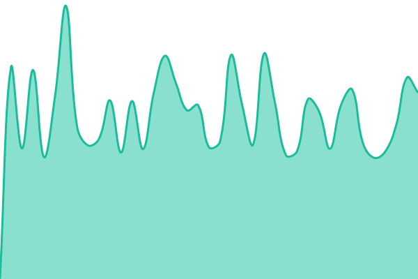 679ms
     
 | 

<a href="https://gegi-status.github.io/history/ude-s-website-prod">89.22%</a>
    

|  [Faculté génie website (prod)](https://www.usherbrooke.ca/genie/) | 🟩 Up | [faculte-genie-website-prod.yml](https://github.com/gegi-status/gegi-status.github.io/commits/HEAD/history/faculte-genie-website-prod.yml) | 

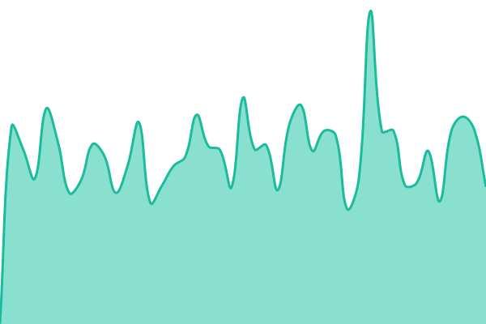 837ms
     
 | 

<a href="https://gegi-status.github.io/history/faculte-genie-website-prod">89.06%</a>
    

|  [Faculté génie (intranet)](https://usherbrooke.sharepoint.com/sites/fgen) | 🟩 Up | [faculte-genie-intranet.yml](https://github.com/gegi-status/gegi-status.github.io/commits/HEAD/history/faculte-genie-intranet.yml) | 

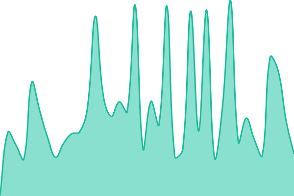 148ms
     
 | 

<a href="https://gegi-status.github.io/history/faculte-genie-intranet">100.00%</a>
    

|  [Département GEGI website (prod)](https://www.usherbrooke.ca/genie-electrique-informatique/) | 🟩 Up | [departement-gegi-website-prod.yml](https://github.com/gegi-status/gegi-status.github.io/commits/HEAD/history/departement-gegi-website-prod.yml) | 

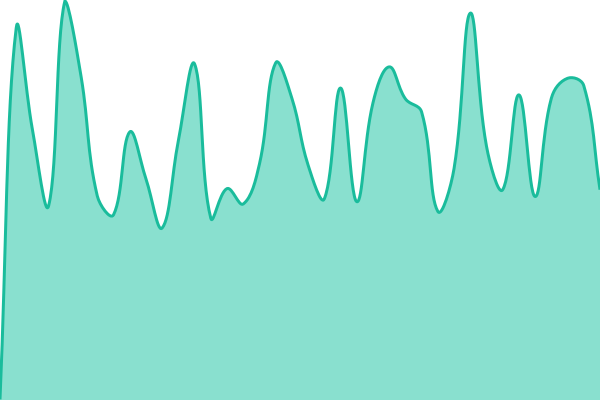 553ms
     
 | 

<a href="https://gegi-status.github.io/history/departement-gegi-website-prod">92.00%</a>
    

|  [Département GEGI (intranet)](https://www.usherbrooke.ca/genie-electrique-informatique/espace-wiki) | 🟩 Up | [departement-gegi-intranet.yml](https://github.com/gegi-status/gegi-status.github.io/commits/HEAD/history/departement-gegi-intranet.yml) | 

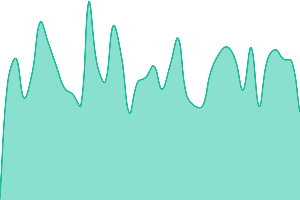 578ms
     
 | 

<a href="https://gegi-status.github.io/history/departement-gegi-intranet">92.10%</a>
    

|  [Wiki GEGI (prod)](https://wiki.gegi.usherbrooke.ca/) | 🟥 Down | [wiki-gegi-prod.yml](https://github.com/gegi-status/gegi-status.github.io/commits/HEAD/history/wiki-gegi-prod.yml) | 

 0ms
     
 | 

<a href="https://gegi-status.github.io/history/wiki-gegi-prod">0.00%</a>
    

|  [Temporary Wiki GEGI (prod) (skip verifying the certificate peer)](https://wiki.gegi.usherbrooke.ca/) | 🟥 Down | [temporary-wiki-gegi-prod-skip-verifying-the-certificate-peer.yml](https://github.com/gegi-status/gegi-status.github.io/commits/HEAD/history/temporary-wiki-gegi-prod-skip-verifying-the-certificate-peer.yml) | 

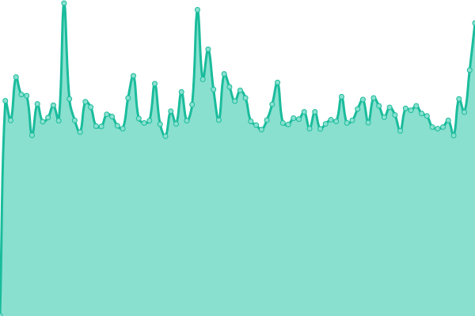 0ms
     
 | 

<a href="https://gegi-status.github.io/history/temporary-wiki-gegi-prod-skip-verifying-the-certificate-peer">100.00%</a>
    

|  [Calendrier facultaire (prod)](https://www.gegi.usherbrooke.ca/calendrier-facultaire/) | 🟩 Up | [calendrier-facultaire-prod.yml](https://github.com/gegi-status/gegi-status.github.io/commits/HEAD/history/calendrier-facultaire-prod.yml) | 

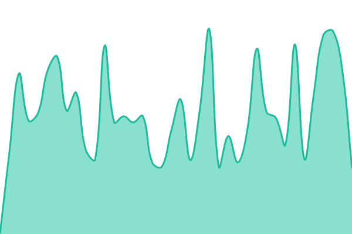 196ms
     
 | 

<a href="https://gegi-status.github.io/history/calendrier-facultaire-prod">96.09%</a>
    

|  [Temporary Calendrier facultaire (prod) (skip verifying the certificate peer)](https://www.gegi.usherbrooke.ca/calendrier-facultaire/) | 🟩 Up | [temporary-calendrier-facultaire-prod-skip-verifying-the-certificate-peer.yml](https://github.com/gegi-status/gegi-status.github.io/commits/HEAD/history/temporary-calendrier-facultaire-prod-skip-verifying-the-certificate-peer.yml) | 

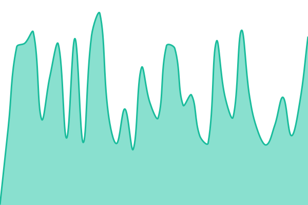 155ms
     
 | 

<a href="https://gegi-status.github.io/history/temporary-calendrier-facultaire-prod-skip-verifying-the-certificate-peer">100.00%</a>
    

|  [Horarius (prod)](https://www.gegi.usherbrooke.ca/horarius/) | 🟩 Up | [horarius-prod.yml](https://github.com/gegi-status/gegi-status.github.io/commits/HEAD/history/horarius-prod.yml) | 

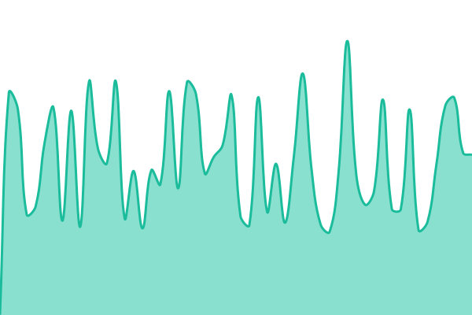 521ms
     
 | 

<a href="https://gegi-status.github.io/history/horarius-prod">92.76%</a>
    

|  [Temporary Horarius (prod) (skip verifying the certificate peer)](https://www.gegi.usherbrooke.ca/horarius/) | 🟩 Up | [temporary-horarius-prod-skip-verifying-the-certificate-peer.yml](https://github.com/gegi-status/gegi-status.github.io/commits/HEAD/history/temporary-horarius-prod-skip-verifying-the-certificate-peer.yml) | 

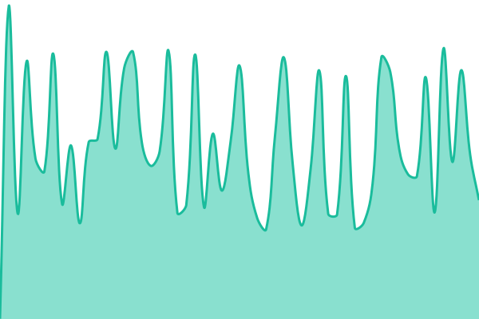 476ms
     
 | 

<a href="https://gegi-status.github.io/history/temporary-horarius-prod-skip-verifying-the-certificate-peer">100.00%</a>
    

|  [Réservation (prod)](https://www.gegi.usherbrooke.ca/reservation/) | 🟩 Up | [reservation-prod.yml](https://github.com/gegi-status/gegi-status.github.io/commits/HEAD/history/reservation-prod.yml) | 

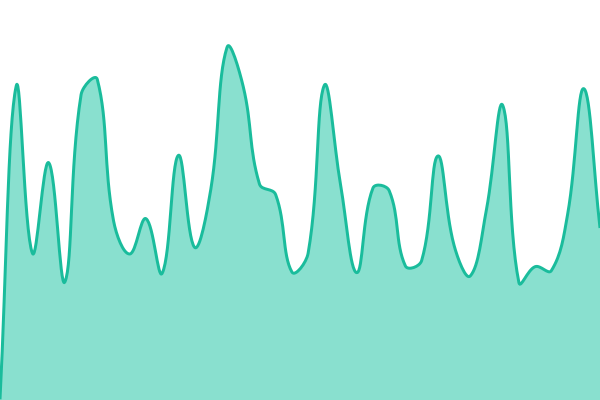 155ms
     
 | 

<a href="https://gegi-status.github.io/history/reservation-prod">97.07%</a>
    

|  [Temporary Réservation (prod) (skip verifying the certificate peer)](https://www.gegi.usherbrooke.ca/reservation/) | 🟩 Up | [temporary-reservation-prod-skip-verifying-the-certificate-peer.yml](https://github.com/gegi-status/gegi-status.github.io/commits/HEAD/history/temporary-reservation-prod-skip-verifying-the-certificate-peer.yml) | 

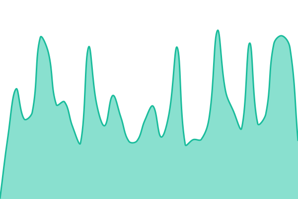 153ms
     
 | 

<a href="https://gegi-status.github.io/history/temporary-reservation-prod-skip-verifying-the-certificate-peer">100.00%</a>
    

<!--end: status pages-->

[**Visit our status website →**](https://gegi-status.github.io)

## 📄 License

- Powered by: [Upptime](https://github.com/upptime/upptime)
- Code: [MIT](./LICENSE) © [gegi-status](https://gegi-status.github.io)
- Data in the `./history` directory: [Open Database License](https://opendatacommons.org/licenses/odbl/1-0/)
